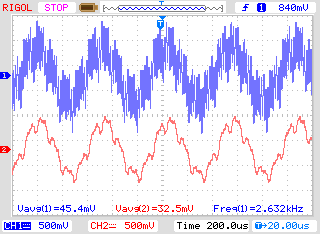

# EclypseZ7 repository by controlpaths.

## Board file
Board file for EclypseZ7 can be found at Digilents repository. (https://github.com/Digilent/vivado-boards/tree/master/new/board_files/eclypse-z7).

## Automatic project creation.
Each project has a script associated to him. For create the project, init Vivado in tcl mode, and the execute the selected script.

```
cd scrips/
vivado -mode tcl -source ./eclypsez7_adc_dac_run.tcl
```
## Hardware configuration
Projects in this repository are designed to run in Eclypse Z7 board from Digilent, with Zmod DAC in Zmod socket A and Zmod ADC in Zmod socket B.  
https://store.digilentinc.com/eclypse-z7-zynq-7000-soc-development-board-with-syzygy-compatible-expansion/

## Python Script
This repository include a python script for generate .mem files. Files generated by script are saved in */memory_content* directory.

## List of projects
- **project1.tcl**  
First project configure ADC to run in demo mode for the channel 1. This means that the reading of channel 1, is not the analog input, whether a ramp signal generated internally by the adc. This signal is getting out through the DAC channel 2. The output of channel 1 is corresponding with the data on the memory signal.mem, that corresponding a sine wave with some harmonics. This memory file is obtained with the jupyter script.
- **fir32_plnx.tcl**  
This project uses the PS for run Petalinux, and the PL for implement a 32th order FIR filter. This filter will filter the signal stored in bram. Filter will be configured from petaliux application available in app folder. Input and outputs signals are sent to Digilent's ZMOD DAC.  
Application has 3 input params: Cut frequency (0-500 -> 0-0.5), Gain (0-200 -> 0-2), and apply a hamming window or not (0,1). For more detailed explanation, visit https://www.controlpaths.com Script for generate block design only available for Vivado 2019.1. If you use other version, in /doc folder, you can find a picture of the block design.  




## More information
If you need more information, yo can contact me on my email pablo@controlpaths.com
